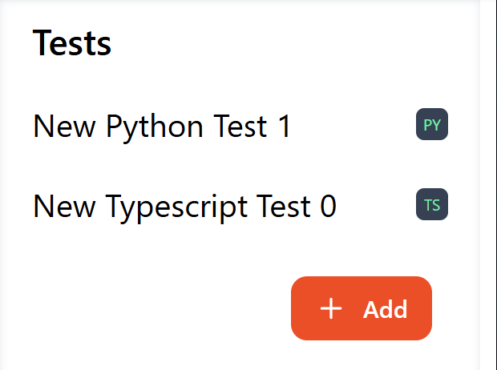
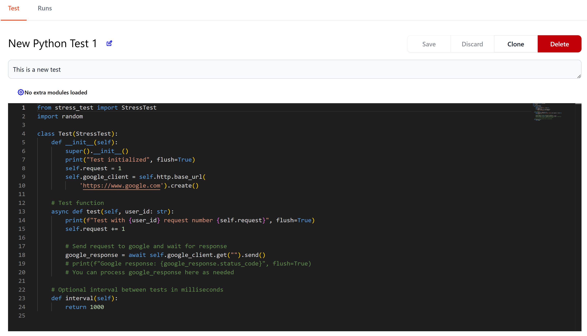

# UI Guide
This guide will help you to get started with the **StressSimple** application. It will walk you through the process of creating a test, running it against your web application, and analyzing the results.

## Tests

Each test in **StressSimple** is a simple script that defines the steps to be executed.

{: width="30%" style="margin-right: 20px;"}

Creating a new test is easy. Just click on the **Add** button in the left drawer.
You will be asked for your preferred programming language. Choose the one you are more comfortable with.

The test editor will open with a sample test script. You can modify it to suit your needs.

## Test Screen

{: width="50%" style="margin-right: 20px;"}

The test screen is divided into three main areas:
  
* Name, Description, and Tags: You can set the test name, description, and tags here.
* Script Editor: This is where you write your test script.
* Actions: You can Save,Clone and delete your test.


A sample test in TypeScript looks like this:

```typescript
import { StressTest } from './StressTest.js';

/**
 * Test class that extends the StressTest base class.
 * This class is used to perform stress testing by sending HTTP requests to a specified server.
 */
export class Test extends StressTest {
  // Counter to track the number of requests made
  private request: number = 1;

  // HTTP client instance configured with the base URL
  private cli = this.http
    .baseUrl('http://localhost:3333') // Stub server URL
    // .header('x-stub-delay', '100') // Uncomment this line to add a delay to all requests
    .create();

  /**
   * Executes the test by sending an HTTP GET request to the server.
   * @param userId - A unique identifier for the user performing the test.
   */
  public async test(userId: string): Promise<void> {
    // Uncomment the following line for debugging purposes
    // console.log("Test with " + userId + ' request number ' + this.request++);

    // Send an HTTP GET request to the server and wait for the response
    await this.cli
      .get('/some-endpoint')
      // Uncomment the following lines to send other types of requests
      // .post('Post request', { userId: userId })
      // .put('Put request', { userId: userId })
      .header('userId', userId)
      .name('stub server')
      .send();
  }

  /**
   * Specifies the interval between consecutive tests in milliseconds.
   * @returns The interval duration in milliseconds.
   */
  public interval(): number {
    return 10;
  }
}
```