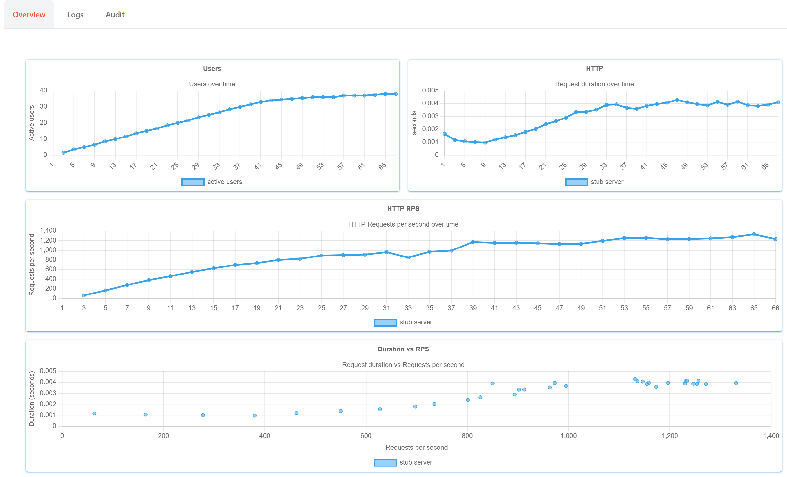

# User Guide

This guide provides a comprehensive example of how to use the **StressSimple** application effectively.

## How It Works

To perform stress testing, you need to create a class named `Test` that extends the `StressTest` base class. This class is responsible for sending HTTP requests during the stress test. The `Test` class must implement the `test` method, which defines the logic for sending HTTP requests. Optionally, you can implement the `interval` method to specify the time interval (in milliseconds) between consecutive tests.

### Key Points:
- The `test` method is invoked repeatedly by the application to send HTTP requests to the server.
- The `interval` method specifies the interval between consecutive tests in milliseconds. If not implemented, the default interval is 1000 milliseconds.
- A test is considered a failure if an exception is thrown during the execution of the `test` method.

## Sample Test Script

```typescript { .select }
import { StressTest } from './StressTest.js';

/**
 * A sample test class that extends the StressTest base class.
 * This class demonstrates how to perform stress testing by sending HTTP requests to a server.
 */
export class Test extends StressTest {
  // Counter to track the number of requests made
  private request: number = 1;

  // HTTP client instance configured with the base URL
  private cli = this.http
    .baseUrl('http://localhost:3333') // Stub server URL
    // .header('x-stub-delay', '100') // Uncomment to add a delay to all requests
    .create();

  /**
   * Executes the test by sending an HTTP GET request to the server.
   * @param userId - A unique identifier for the user performing the test.
   */
  public async test(userId: string): Promise<void> {
    // Uncomment the following line for debugging purposes
    // console.log("Test with " + userId + ' request number ' + this.request++);

    // Send an HTTP GET request to the server
    await this.cli
      .get('/some-endpoint')
      // Uncomment to send other types of requests
      // .post('Post request', { userId: userId })
      // .put('Put request', { userId: userId })
      .header('userId', userId)
      .name('stub server')
      .send();
  }

  /**
   * Specifies the interval between consecutive tests in milliseconds.
   * @returns The interval duration in milliseconds.
   */
  public interval(): number {
    return 10;
  }
}
```

## Test Execution


### Test Execution Settings
- **Number of Users**: The number of users to simulate.
- **Duration**: The duration of the test in seconds.
- **Ramp-Up Time**: The time in seconds to gradually increase to the specified number of users.

### Screen Actions
- Click the `Run` button to start a test execution.
- Click the `Stop` button to cancel a running test execution.
- Click the `Delete` button to remove a test execution.
- Click on a test execution row to view detailed results.

## Test Results

### Overview


- This screen provides a real-time graphical representation of the test results.

### Logs
- Open the "Logs" tab to view `console.log` or `print` messages generated during the test execution.

### Audit


- The "Audit" section displays detailed information about the HTTP requests sent during the test execution.
